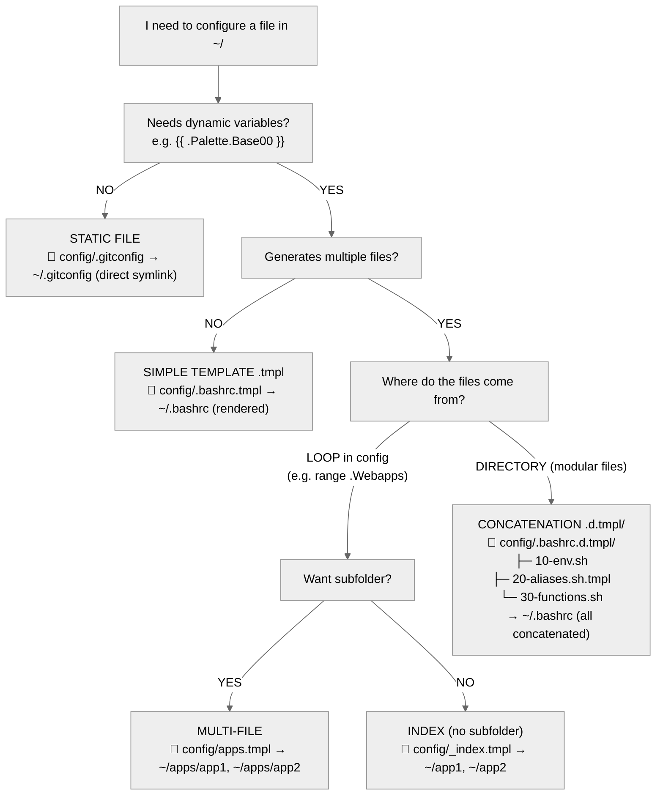

# Workspaced Template System - Quick Guide

## 🌳 Decision Tree



---

## 📋 Types (Quick Reference)

### 1️⃣ Static File
```
config/.gitconfig
```
→ `~/.gitconfig` (symlink)

### 2️⃣ Simple Template
```bash
# config/.bashrc.tmpl
source {{ dotfiles }}/bin/source_me
```
→ `~/.bashrc` (rendered)

### 3️⃣ Multi-File
```go
# config/apps.tmpl
{{- range .Apps }}
{{- file (printf "%s.desktop" .name) }}
[Desktop Entry]
Name={{ .name }}
{{- endfile }}
{{- end }}
```
→ `~/apps/app1.desktop`, `~/apps/app2.desktop`

### 4️⃣ Index (no subfolder)
```go
# config/_index.tmpl
{{- file "app1.desktop" }}...{{- endfile }}
{{- file "app2.desktop" }}...{{- endfile }}
```
→ `~/app1.desktop`, `~/app2.desktop`

### 5️⃣ Concatenation (.d.tmpl/)
```
config/.bashrc.d.tmpl/
├─ 10-env.sh
├─ 20-aliases.sh.tmpl
└─ 30-functions.sh
```
→ `~/.bashrc` (all together, alphabetical order)

---

## 🔧 Essential Functions

### Control
```go
{{ skip }}                          # Do not generate this file
{{ file "name" "0755" }}            # Start file (mode optional)
{{ endfile }}                       # End file (optional)
```

### Conditionals
```go
{{- if cond }}...{{- end }}
{{- if not isPhone }}{{ skip }}{{ end }}
```

### Loops
```go
{{- range .Items }}...{{- end }}
{{- range $key, $val := .Map }}...{{- end }}
```

### Paths
```go
{{ dotfiles }}                      # ~/.dotfiles
{{ userDataDir }}                   # ~/.local/share/workspaced
```

### Strings
```go
{{ split "a:b" ":" }}               # ["a", "b"]
{{ join .Array "," }}               # "a,b,c"
{{ last .Array }}                   # last element
{{ titleCase "foo" }}               # "Foo"
{{ replace .Text "old" "new" }}
```

### Lists
```go
{{ list "a" "b" }}                  # ["a", "b"]
{{ default "fallback" .Value }}     # .Value or fallback if empty
```

### System
```go
{{ readDir "/path" }}               # list files
{{ isPhone }}                       # true on Android
{{ isWayland }}                     # true on Wayland
{{ favicon "https://..." }}         # download favicon, returns path
```

---

## ⚡ Practical Examples

### Desktop File
```
# config/.local/share/applications/backup.desktop.tmpl
[Desktop Entry]
Name=Backup
Exec=workspaced home backup run
Terminal=true
```

### Webapps (multiple)
```go
# config/.local/share/applications/_index.tmpl
{{- range $name, $wa := .Webapps }}
{{- file (printf "workspaced-webapp-%s.desktop" $name) }}
[Desktop Entry]
Name={{ titleCase $name }}
Exec={{ $.root.browser.webapp }} --app={{ $wa.URL }}
Icon={{ favicon $wa.URL }}
{{- endfile }}
{{- end }}
```

### Bashrc Modular
```
config/.bashrc.d.tmpl/
  ├─ 10-env.sh              # export EDITOR=vim
  ├─ 20-aliases.sh.tmpl     # alias dots="cd {{ dotfiles }}"
  └─ 30-functions.sh        # mkcd() { ... }
```

### Skip Condicional
```go
# config/.shortcuts/_index.tmpl
{{- if not isPhone }}{{ skip }}{{ end -}}
{{- range readDir (printf "%s/bin/_shortcuts/termux" (dotfiles)) }}
{{- file . "0755" }}
#!/data/data/com.termux/files/usr/bin/bash
...
{{- endfile }}
{{- end }}
```

---

## ⚠️ Pitfalls

| ❌ Wrong | ✅ Correct | Why |
|----------|------------|-----|
| `{{ file "x" }}` | `{{- file "x" }}` | `-` removes whitespace |
| `foo.tmpl` multi-file | `_index.tmpl` | `foo` becomes extra folder |
| `.bashrc.d/` concatenates | `.bashrc.d.tmpl/` | `.d/` creates symlinks |
| `{{ file "script" }}` | `{{ file "script" "0755" }}` | Scripts need +x |
| `{{ skip }}` in the middle | `{{- if cond }}{{ skip }}{{- end }}` at the beginning | Parser breaks | |

---

## 🎯 Internal Flow

1. `SymlinkProvider` scans `config/`
2. **Directory `.d.tmpl/`** → concatenates, skips recursion
3. **File `.tmpl`** → renders
4. **Marker `<<<WORKSPACED_FILE:..>>>`** → multi-file
5. **Normal file** → symlink
6. Compares with `~/.local/share/workspaced/state.json`
7. Applies: create/update/delete

---

## 🚀 Generator Bundle Fast-Path

For generator modules (e.g.: icons), the provider must include a bundle fingerprint in the `SourceInfo`.

Recommended format:

```text
module:<name> bundle:<fingerprint> (<relative-file>)
```

With this, the planner can skip heavy content comparison per file when:

1. `managed == true`
2. `current.SourceInfo == desired.SourceInfo`
3. `SourceInfo` contains `bundle:`

Result: massive `noop` drops from seconds to milliseconds when the bundle hasn't changed.

Best practices for the fingerprint:

1. include engine version (`v1`, `v2`, ...)
2. include effective module config (`sizes`, `map_scheme`, etc.)
3. include palette/theme (e.g.: base16)
4. include source snapshot (`count`, `size`, `max_mtime` or file hash)

---

## 🧪 Test

```bash
workspaced home apply --dry-run
```

---

## 📚 References

- Go templates: https://pkg.go.dev/text/template
- Code: `nix/pkgs/workspaced/pkg/apply/provider_symlink.go`
