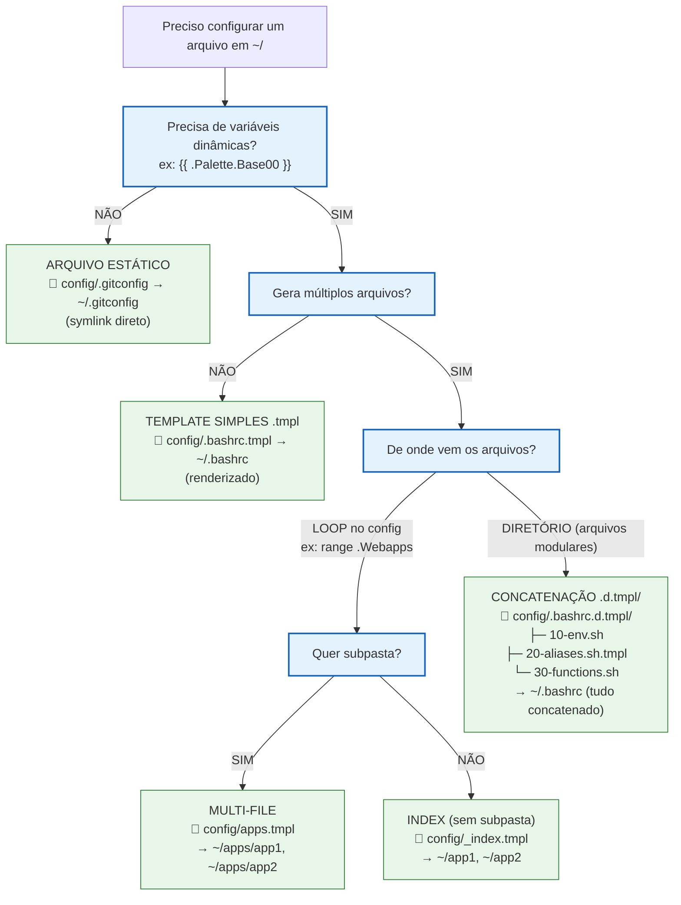

# Workspaced Template System - Guia Rápido

## 🌳 Árvore de Decisão



---

## 📋 Tipos (Referência Rápida)

### 1️⃣ Arquivo Estático
```
config/.gitconfig
```
→ `~/.gitconfig` (symlink)

### 2️⃣ Template Simples
```bash
# config/.bashrc.tmpl
source {{ dotfiles }}/bin/source_me
```
→ `~/.bashrc` (renderizado)

### 3️⃣ Multi-File
```go
# config/apps.tmpl
{{- range .Apps }}
{{- file (printf "%s.desktop" .name) }}
[Desktop Entry]
Name={{ .name }}
{{- endfile }}
{{- end }}
```
→ `~/apps/app1.desktop`, `~/apps/app2.desktop`

### 4️⃣ Index (sem subpasta)
```go
# config/_index.tmpl
{{- file "app1.desktop" }}...{{- endfile }}
{{- file "app2.desktop" }}...{{- endfile }}
```
→ `~/app1.desktop`, `~/app2.desktop`

### 5️⃣ Concatenação (.d.tmpl/)
```
config/.bashrc.d.tmpl/
├─ 10-env.sh
├─ 20-aliases.sh.tmpl
└─ 30-functions.sh
```
→ `~/.bashrc` (tudo junto, ordem alfabética)

---

## 🔧 Funções Essenciais

### Controle
```go
{{ skip }}                          # Não gera este arquivo
{{ file "nome" "0755" }}            # Inicia arquivo (mode opcional)
{{ endfile }}                       # Termina arquivo (opcional)
```

### Condições
```go
{{- if cond }}...{{- end }}
{{- if not isPhone }}{{ skip }}{{ end }}
```

### Loops
```go
{{- range .Items }}...{{- end }}
{{- range $key, $val := .Map }}...{{- end }}
```

### Paths
```go
{{ dotfiles }}                      # ~/.dotfiles
{{ userDataDir }}                   # ~/.local/share/workspaced
```

### Strings
```go
{{ split "a:b" ":" }}               # ["a", "b"]
{{ join .Array "," }}               # "a,b,c"
{{ last .Array }}                   # último elemento
{{ titleCase "foo" }}               # "Foo"
{{ replace .Text "old" "new" }}
```

### Listas
```go
{{ list "a" "b" }}                  # ["a", "b"]
{{ default "fallback" .Value }}     # .Value ou fallback se vazio
```

### Sistema
```go
{{ readDir "/path" }}               # lista arquivos
{{ isPhone }}                       # true em Android
{{ isWayland }}                     # true em Wayland
{{ favicon "https://..." }}         # baixa favicon, retorna path
```

---

## ⚡ Exemplos Práticos

### Desktop File
```
# config/.local/share/applications/backup.desktop.tmpl
[Desktop Entry]
Name=Backup
Exec=workspaced home backup run
Terminal=true
```

### Webapps (múltiplos)
```go
# config/.local/share/applications/_index.tmpl
{{- range $name, $wa := .Webapps }}
{{- file (printf "workspaced-webapp-%s.desktop" $name) }}
[Desktop Entry]
Name={{ titleCase $name }}
Exec={{ $.root.browser.webapp }} --app={{ $wa.URL }}
Icon={{ favicon $wa.URL }}
{{- endfile }}
{{- end }}
```

### Bashrc Modular
```
config/.bashrc.d.tmpl/
  ├─ 10-env.sh              # export EDITOR=vim
  ├─ 20-aliases.sh.tmpl     # alias dots="cd {{ dotfiles }}"
  └─ 30-functions.sh        # mkcd() { ... }
```

### Skip Condicional
```go
# config/.shortcuts/_index.tmpl
{{- if not isPhone }}{{ skip }}{{ end -}}
{{- range readDir (printf "%s/bin/_shortcuts/termux" (dotfiles)) }}
{{- file . "0755" }}
#!/data/data/com.termux/files/usr/bin/bash
...
{{- endfile }}
{{- end }}
```

---

## ⚠️ Armadilhas

| ❌ Errado | ✅ Correto | Por quê |
|-----------|------------|---------|
| `{{ file "x" }}` | `{{- file "x" }}` | `-` remove espaços |
| `foo.tmpl` multi-file | `_index.tmpl` | `foo` vira pasta extra |
| `.bashrc.d/` concatena | `.bashrc.d.tmpl/` | `.d/` faz symlinks |
| `{{ file "script" }}` | `{{ file "script" "0755" }}` | Scripts precisam +x |
| `{{ skip }}` no meio | `{{- if cond }}{{ skip }}{{- end }}` no início | Parser quebra |

---

## 🎯 Fluxo Interno

1. `SymlinkProvider` varre `config/`
2. **Diretório `.d.tmpl/`** → concatena, skip recursão
3. **Arquivo `.tmpl`** → renderiza
4. **Marcador `<<<WORKSPACED_FILE:..>>>`** → multi-file
5. **Arquivo normal** → symlink
6. Compara com `~/.local/share/workspaced/state.json`
7. Aplica: create/update/delete

---

## 🚀 Generator Bundle Fast-Path

Para módulos geradores (ex.: ícones), o provider deve incluir um fingerprint de bundle no `SourceInfo`.

Formato recomendado:

```text
module:<nome> bundle:<fingerprint> (<arquivo-relativo>)
```

Com isso, o planner pode pular comparação pesada de conteúdo por arquivo quando:

1. `managed == true`
2. `current.SourceInfo == desired.SourceInfo`
3. `SourceInfo` contém `bundle:`

Resultado: `noop` massivo cai de segundos para milissegundos quando o bundle não mudou.

Boas práticas para o fingerprint:

1. incluir versão do engine (`v1`, `v2`, ...)
2. incluir config efetiva do módulo (`sizes`, `map_scheme`, etc.)
3. incluir palette/tema (ex.: base16)
4. incluir snapshot da source (`count`, `size`, `max_mtime` ou hash de arquivos)

---

## 🧪 Testar

```bash
workspaced home apply --dry-run
```

---

## 📚 Ref

- Go templates: https://pkg.go.dev/text/template
- Código: `nix/pkgs/workspaced/pkg/apply/provider_symlink.go`
