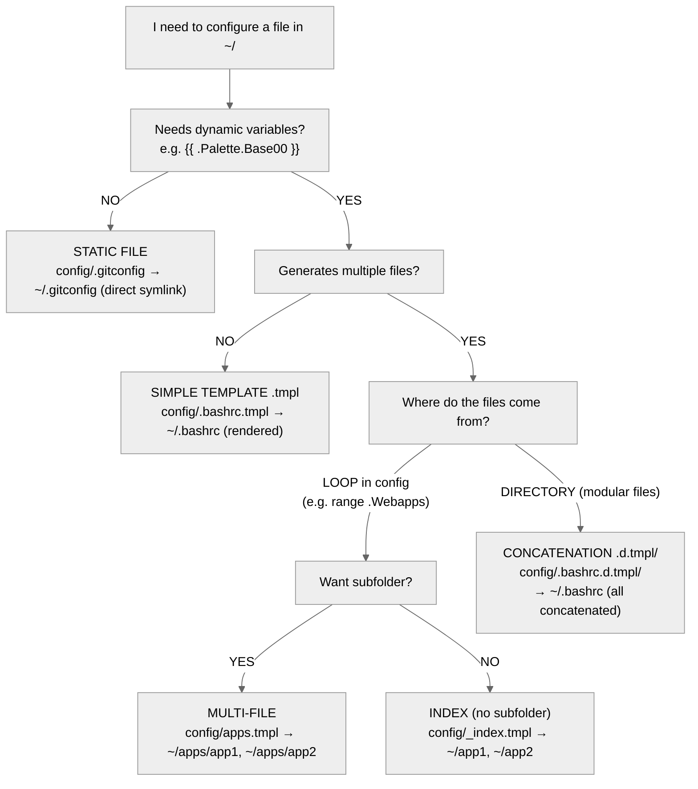

# Templates

**Canonical** template guide for this repo (no separate `TEMPLATES.md`).

| Depth | Sections | When |
|-------|----------|------|
| **Essential** | Model, decision tree, kinds table, context, gotchas (kind/layout + ops) | Choosing kind, debugging “file didn’t appear”, light edits |
| **Deep** | Per-kind examples, function catalog, practical examples, internal flow, generator fast-path | Authoring/editing templates or generator modules |

Stop after **essential** unless you are writing or substantially changing templates.

## Model (essential)

Templates are how modules turn **source layout + config/context** into
**target files** (usually under home for home modules, or into a codebase tree
for codebase flows). Apply runs the pipeline; editing a template without
plan/apply only changes source.

Workspaced distinguishes **artifact kinds**. Choosing the wrong kind is the
main template footgun — not missing a flag.

**Config drives data; layout drives files:**

- Changing **cue `config`** changes values inside already-declared templates.
- Adding **new target paths** usually means new/changed files under the module’s
  `config/` (or equivalent) layout, correct **kind** suffix/structure, then apply.
- `{{ skip }}` / conditionals can omit outputs without deleting the template
  source.

Templates are inert until the source pipeline runs in **plan** (preview) or
**apply** (write). If plan doesn’t list an expected target, the issue is usually
module enablement, path/kind, `skip`/conditionals, or wrong workspace — not
“template engine broken.” See `plan-and-apply.md` and `modules.md`.

## Decision tree (essential)



One-liner: dynamic? → not static. Many outputs from one generator? → multi-file
vs index (subdir or not). Many sources into one output? → `.d.tmpl`.

## Artifact kinds (essential summary)

| Kind | Source shape | Result | Use when |
|------|--------------|--------|----------|
| **Static** | e.g. `config/.gitconfig` | Symlink/place as-is | No dynamic content |
| **Simple template** | `something.tmpl` | One rendered file at target | Needs `{{ … }}` once |
| **Multi-file** | a `.tmpl` that uses `file` / `endfile` (often with `range`) | Many files under a target **subdir** | Loop-driven set of files in a folder |
| **Index** | `_index.tmpl` with `file` / `endfile` | Many files at target **root** (no extra subfolder) | Same as multi-file but flat placement |
| **Concat (`.d.tmpl/`)** | Directory of ordered fragments (some may be `.tmpl`) | **One** target file, pieces concatenated | bashrc-style composable single file |

## Kind examples (deep)

### 1. Static file

```text
config/.gitconfig
```

→ `~/.gitconfig` (symlink)

### 2. Simple template

```bash
# config/.bashrc.tmpl
source {{ dotfiles }}/bin/source_me
```

→ `~/.bashrc` (rendered)

### 3. Multi-file

```go
# config/apps.tmpl
{{- range .Apps }}
{{- file (printf "%s.desktop" .name) }}
[Desktop Entry]
Name={{ .name }}
{{- endfile }}
{{- end }}
```

→ `~/apps/app1.desktop`, `~/apps/app2.desktop` (extra folder from template name)

### 4. Index (no subfolder)

```go
# config/_index.tmpl
{{- file "app1.desktop" }}...{{- endfile }}
{{- file "app2.desktop" }}...{{- endfile }}
```

→ `~/app1.desktop`, `~/app2.desktop`

### 5. Concatenation (`.d.tmpl/`)

```text
config/.bashrc.d.tmpl/
├─ 10-env.sh
├─ 20-aliases.sh.tmpl
└─ 30-functions.sh
```

→ `~/.bashrc` (all together, alphabetical order)

## Context (essential)

Templates are not only module `config`. Example module docs show patterns like:

- **Module config** — e.g. `.module.greeting` (from cue `modules.<id>.config`)
- **Runtime** — hostname, phone/desktop, display server, etc.
- **Root config** — broader workspaced config (e.g. `.root.hosts`,
  `$.root.browser.webapp`)

**Practical rule for agents:** when unsure what fields exist, open **existing
templates and cue** in that module/user tree rather than inventing `.Foo`.

Go `text/template` syntax applies underneath:
https://pkg.go.dev/text/template

## Functions (deep)

### Control

```go
{{ skip }}                          # Do not generate this file
{{ file "name" "0755" }}            # Start file (mode optional)
{{ endfile }}                       # End file (optional)
```

### Conditionals

```go
{{- if cond }}...{{- end }}
{{- if not isPhone }}{{ skip }}{{ end }}
```

### Loops

```go
{{- range .Items }}...{{- end }}
{{- range $key, $val := .Map }}...{{- end }}
```

### Paths

```go
{{ dotfiles }}                      # ~/.dotfiles
{{ userDataDir }}                   # ~/.local/share/workspaced
```

### Strings

```go
{{ split "a:b" ":" }}               # ["a", "b"]
{{ join .Array "," }}               # "a,b,c"
{{ last .Array }}                   # last element
{{ titleCase "foo" }}               # "Foo"
{{ replace .Text "old" "new" }}
```

### Lists

```go
{{ list "a" "b" }}                  # ["a", "b"]
{{ default "fallback" .Value }}     # .Value or fallback if empty
```

### System

```go
{{ readDir "/path" }}               # list files
{{ isPhone }}                       # true on Android
{{ isWayland }}                     # true on Wayland
{{ favicon "https://..." }}         # download favicon, returns path
```

## Practical examples (deep)

### Desktop file

```text
# config/.local/share/applications/backup.desktop.tmpl
[Desktop Entry]
Name=Backup
Exec=workspaced home backup run
Terminal=true
```

### Webapps (multiple, index)

```go
# config/.local/share/applications/_index.tmpl
{{- range $name, $wa := .Webapps }}
{{- file (printf "workspaced-webapp-%s.desktop" $name) }}
[Desktop Entry]
Name={{ titleCase $name }}
Exec={{ $.root.browser.webapp }} --app={{ $wa.URL }}
Icon={{ favicon $wa.URL }}
{{- endfile }}
{{- end }}
```

### Bashrc modular (concat)

```text
config/.bashrc.d.tmpl/
  ├─ 10-env.sh              # export EDITOR=vim
  ├─ 20-aliases.sh.tmpl     # alias dots="cd {{ dotfiles }}"
  └─ 30-functions.sh        # mkcd() { ... }
```

### Skip conditional (index + readDir)

```go
# config/.shortcuts/_index.tmpl
{{- if not isPhone }}{{ skip }}{{ end -}}
{{- range readDir (printf "%s/bin/_shortcuts/termux" (dotfiles)) }}
{{- file . "0755" }}
#!/data/data/com.termux/files/usr/bin/bash
...
{{- endfile }}
{{- end }}
```

## Internal flow (deep)

Conceptual pipeline when scanning module `config/`:

1. Provider scans `config/`
2. **Directory `.d.tmpl/`** → concatenates, skips recursion into that dir as
   normal tree
3. **File `.tmpl`** → renders (may emit multi-file markers)
4. **Marker `<<<WORKSPACED_FILE:..>>>`** (from `file`/`endfile`) → multi-file
   outputs
5. **Normal file** → symlink / static place
6. Compares with managed state (e.g. under `~/.local/share/workspaced/state.json`)
7. Applies: create / update / delete

Implementation lives under `pkg/source/` and apply/deployer paths in this repo
(older docs may mention `provider_symlink`-style names; trust current package
layout when navigating code).

## Generator bundle fast-path (deep; generator authors)

For generator modules (e.g. icons), the provider should include a **bundle
fingerprint** in `SourceInfo` so the planner can skip heavy per-file content
comparison when the bundle has not changed.

Recommended format:

```text
module:<name> bundle:<fingerprint> (<relative-file>)
```

Planner can treat as cheap **noop** when:

1. `managed == true`
2. `current.SourceInfo == desired.SourceInfo`
3. `SourceInfo` contains `bundle:`

Result: large managed trees drop from seconds of compare work to milliseconds
when the bundle is unchanged.

Fingerprint best practices:

1. Include engine version (`v1`, `v2`, …)
2. Include effective module config (`sizes`, `map_scheme`, etc.)
3. Include palette/theme (e.g. base16)
4. Include source snapshot (`count`, `size`, `max_mtime` or file hash)

This section matters mainly when **authoring generator-style modules** (icons,
themes), not for ordinary static/tmpl files.

## Trying changes (essential pointer)

Prefer **`home`/`codebase` `plan`** then apply; flags/dry-run from
`workspaced home apply --help`. Loop: `plan-and-apply.md`. Do not maintain a
second flag list here.

## Gotchas (essential)

### Kind / layout mistakes

| Wrong | Correct | Why |
|-------|---------|-----|
| `{{ file "x" }}` (noisy whitespace) | `{{- file "x" }}` | `-` trims whitespace in Go templates |
| Multi-file in `foo.tmpl` when you wanted flat targets | `_index.tmpl` | Non-index name becomes an **extra folder** |
| `.bashrc.d/` expecting concat | `.bashrc.d.tmpl/` | Plain `.d/` is not the concat convention; you get normal dir/symlink behavior |
| `{{ file "script" }}` for executables | `{{ file "script" "0755" }}` | Scripts need execute mode |
| `{{ skip }}` mid-file | `{{- if cond }}{{ skip }}{{- end }}` **at the beginning** | Skip mid-stream breaks the parser/flow |

### Ops / selection

- **Static file but content has `{{`** — won’t render; use `.tmpl` (or accept
  literal braces).
- **Wanted one bashrc from many snippets, used multi-file** — many files, not
  one target; use `.d.tmpl/`.
- **Wanted many desktop files, used `.d.tmpl`** — one merged file; use multi-file
  or index.
- **Multi-file vs `_index.tmpl`** — subfolder vs flat; wrong choice looks like
  files in the wrong place.
- **Edited template, didn’t apply** — source updated, home/repo unchanged; run
  plan/apply in the right command family (`home` vs `codebase`).
- **Invented context fields** — fails or empty at render; copy from sibling
  templates or module README/cue.
- **Module disabled / wrong input path** — perfect templates, never selected
  (`modules.md`).
- **Conditionals / `skip` always true** — “missing” file is intentional; check
  `isPhone`, enable flags, etc. in cue/runtime.
- **Generator module slow every apply** — missing/unstable `bundle:` fingerprint
  in `SourceInfo`; see deep generator section above.
- **Confusing plan empty with engine bug** — usually enablement, kind, `skip`,
  or wrong workspace (`config-and-roots.md`).
